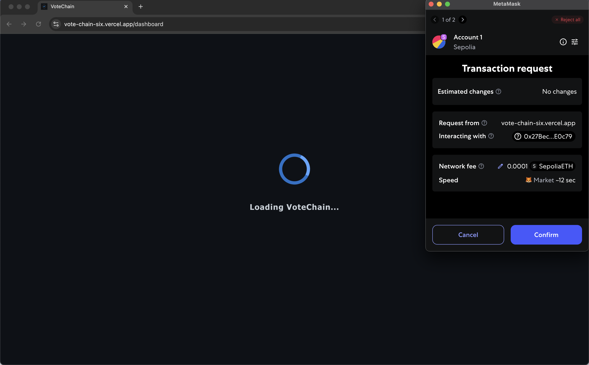
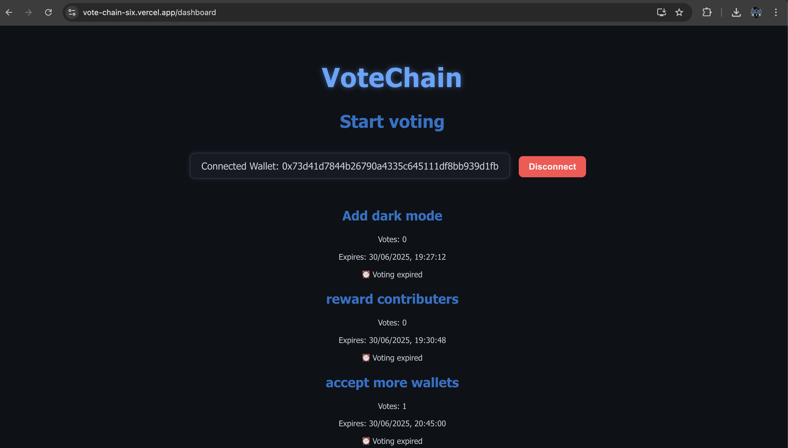

# 🗳️ VoteChain — Decentralized Voting dApp

**VoteChain** is a Web3 application built with **React** and **Ethers.js** that enables users to connect their Ethereum wallet, view voting proposals, and cast votes securely on the blockchain.  

This project demonstrates practical skills in frontend React development combined with blockchain interaction fundamentals, serving as a foundation for a fully decentralized governance system.

---

## 🚀 Features

- 🔐 Connect your Ethereum wallet via MetaMask  
- 📋 Display a list of voting proposals  
- ✅ Allow users to vote once per proposal  
- 🎨 Clean and responsive UI with dark mode styling  
- ⚙️ Uses Ethers.js for wallet connection and blockchain interaction  

---

## 💡 Current Status

- Solidity smart contract developed for managing proposals and votes on-chain (contract code included in `/contracts` folder)  
- Transactional interactions (adding proposals, voting) fully on-chain with ETH gas costs  

---

## 📦 Technology Stack

- React (Vite) for frontend UI  
- Ethers.js (v6) for Ethereum blockchain interaction  
- Solidity (v0.8.28) for smart contract development + Hardhat
- CSS3 with custom dark mode design  

---

## 🚀 Live Demo

👉 Frontend: [votechain.vercel.app](https://vote-chain-six.vercel.app/)  
👉 Smart Contract: 0x27BecC2383DF6ACD2A9C0e578e3b0A5656fE0c79 (Deployed on Sepolia)

---

 ## 🖼️ Demo Screens

| Wallet connection + gas transaction | Proposals |
|-----------|--------------|
|  |  |

---

## 🛠️ Roadmap

- Enhance UI/UX and add accessibility features

---

## 📚 Learning Goals

This project is part of my journey to become proficient in Web3 development by:  
- Building a full-stack dApp integrating frontend React with Ethereum smart contracts  
- Gaining hands-on experience with wallet connectivity, blockchain reads/writes, and gas management  
- Understanding decentralized governance mechanisms and how to implement them  

---

## Get started

   ```bash
   git clone https://github.com/bbell2411/votechain.git
   cd votechain
   npm install
   npm run start
```
---

## 📝 License

MIT License — Feel free to use and learn from this project!


